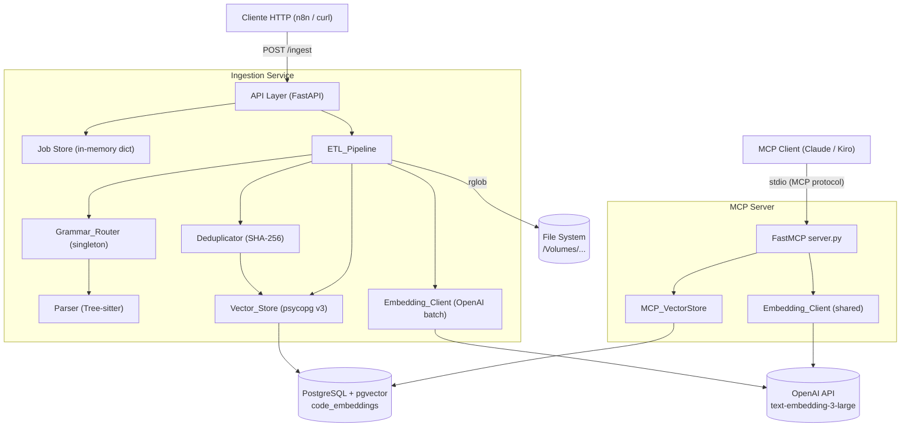
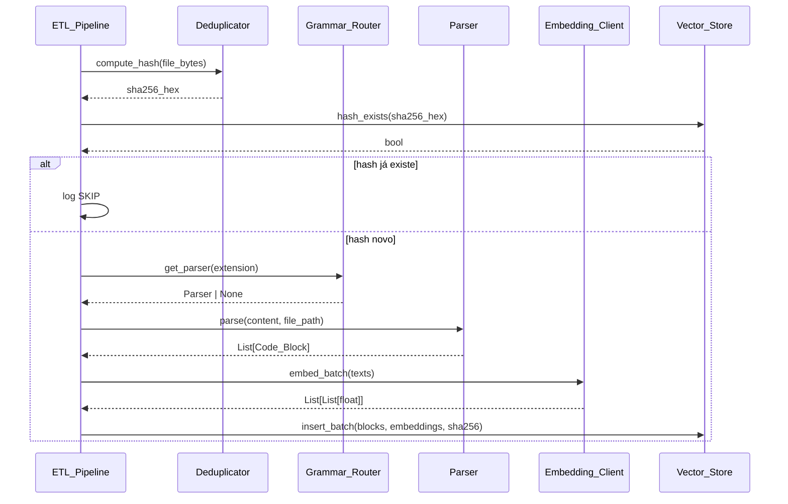
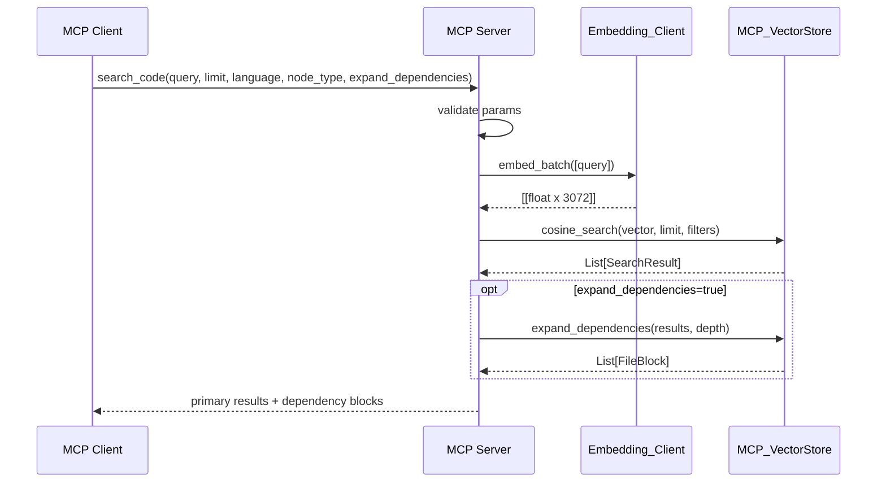

# Tallo RAG — Architecture & Implementation Reference

## Overview

Tallo RAG é um sistema de busca semântica de código-fonte composto por dois serviços complementares:

- **Ingestion Service** — percorre repositórios locais, extrai blocos lógicos de código via Tree-sitter, gera embeddings com `text-embedding-3-large` e persiste no pgvector.
- **MCP Server** — expõe ferramentas de consulta semântica via [Model Context Protocol](https://modelcontextprotocol.io/), permitindo que LLMs (Claude, Kiro, etc.) consultem o banco de embeddings diretamente, com suporte a expansão de dependências entre arquivos.

### Objetivos de Design

| Objetivo | Descrição |
|---|---|
| Semântica sobre sintaxe | Extrair unidades lógicas (métodos, classes, funções, queries) em vez de chunks arbitrários de texto |
| Resiliência | Falhas em arquivos individuais não interrompem o pipeline — filosofia fail-per-file, not fail-fast |
| Eficiência | Deduplicação via SHA-256 evita reprocessamento; batch de embeddings minimiza chamadas à API OpenAI |
| Observabilidade | Logs estruturados em JSON com métricas por arquivo e sumário por job |
| Extensibilidade | Grammar_Router desacoplado permite adicionar novas linguagens sem alterar o pipeline |
| Integração direta | LLMs invocam ferramentas MCP sem camadas intermediárias |
| Rastreabilidade | Metadados de dependência (injects, calls, tables) permitem reconstruir cadeias Controller → Service → Repository |

---

## System Architecture



---

## Repository Structure

```
tallo-rag-ingestion/
├── main.py                        # Entrypoint FastAPI (app, lifespan)
├── config.py                      # Settings + load_settings()
├── api/
│   ├── routes.py                  # POST /ingest, GET /ingest/{id}/status, GET /health
│   └── schemas.py                 # Pydantic models
├── pipeline/
│   ├── etl_pipeline.py            # Orquestrador principal
│   ├── grammar_router.py          # Singleton de gramáticas Tree-sitter
│   ├── parser.py                  # Extração de blocos + metadados de dependência
│   ├── deduplicator.py            # SHA-256
│   ├── embedding_client.py        # Batch OpenAI / Azure OpenAI com tenacity
│   └── vector_store.py            # psycopg v3 + pgvector
├── models/
│   └── code_block.py              # Dataclass Code_Block
├── tallo_mcp/
│   ├── server.py                  # FastMCP app + tool definitions
│   ├── db.py                      # MCP_VectorStore + expand_dependencies
│   └── config.py                  # load_mcp_settings()
├── db/
│   └── migrations/
│       ├── 001_create_code_embeddings.sql
│       └── 002_add_gin_index_metadata.sql
├── docs/
│   ├── architecture.md            # Este documento
│   └── dependency-extraction.md  # Detalhes da extração de dependências
└── utils/
    └── logging.py                 # Logging estruturado JSON
```

---

## Ingestion Service

### Pipeline Flow (per file)



### Supported Languages

| Extension | Language | Extracted Block Types |
|---|---|---|
| `.java` | Java | `method_declaration`, `class_declaration` |
| `.jsx`, `.tsx` | JavaScript/TypeScript | `function_declaration`, `arrow_function`, `jsx_element` |
| `.html` | HTML | `element` (top-level only) |
| `.cfm`, `.cfc` | CFML | `cfcomponent`, `cffunction`, `cfquery`, `sql_injection` |
| `.sql` | SQL | `statement` (classified as `ddl_statement` or `dml_statement`) |

### Deduplication

The hash is computed over the **raw binary content** of the file:

```python
hashlib.sha256(file_bytes).hexdigest()  # 64-char hex string
```

Before processing any file, the pipeline checks:

```sql
SELECT 1 FROM code_embeddings
WHERE metadata->>'file_sha256' = '<hash>'
LIMIT 1
```

If a record exists, the entire file is skipped. Deduplication is file-level — a single changed byte causes full reprocessing of all blocks in that file.

### Embedding

- Model: `text-embedding-3-large` (3072 dimensions)
- All blocks from a file are sent in a **single batch call** to the OpenAI API
- Retry policy: exponential backoff via `tenacity`, up to 5 attempts, only on HTTP 429 (rate limit)
  - Wait schedule: 2s → 4s → 8s → 16s → 60s cap → fail

### REST API

| Endpoint | Method | Description |
|---|---|---|
| `/ingest` | POST | Start async ingestion job, returns `job_id` (HTTP 202) |
| `/ingest/{job_id}/status` | GET | Poll job status and metrics |
| `/health` | GET | Check PostgreSQL and OpenAI connectivity |

**Job status values:** `pending` → `running` → `completed` / `failed`

**Metrics returned:**

```json
{
  "files_discovered": 142,
  "files_processed": 138,
  "files_skipped": 3,
  "files_failed": 1,
  "blocks_inserted": 1847,
  "elapsed_seconds": 34.21
}
```

---

## MCP Server

### Tool Invocation Flow



### Tools

#### `search_code`

Semantic search over all indexed code blocks.

| Parameter | Type | Default | Description |
|---|---|---|---|
| `query` | `string` | required | Natural language or code snippet |
| `limit` | `int` | `10` | Max results (1–50) |
| `language` | `string` | `null` | Filter by language: `java`, `sql`, `cfml`, etc. |
| `node_type` | `string` | `null` | Filter by block type: `method_declaration`, `cfquery`, etc. |
| `expand_dependencies` | `bool` | `false` | Resolve and return dependent blocks |
| `dependency_depth` | `int` | `1` | Levels of dependency chain to follow (1–3) |

#### `get_file_blocks`

Returns all indexed blocks for a specific file, ordered by `start_line`.

| Parameter | Type | Description |
|---|---|---|
| `file_path` | `string` | Full path of the file |

#### `list_indexed_files`

Lists all unique indexed files with block count and detected language, sorted alphabetically.

No parameters.

---

## Data Model

### Database Schema

```sql
CREATE EXTENSION IF NOT EXISTS vector;

CREATE TABLE code_embeddings (
    id          UUID         PRIMARY KEY DEFAULT gen_random_uuid(),
    content     TEXT         NOT NULL,
    file_path   TEXT         NOT NULL,
    metadata    JSONB,
    embedding   vector(3072)
);

-- Semantic similarity search
CREATE INDEX ON code_embeddings
    USING hnsw (embedding vector_cosine_ops);

-- Deduplication by file hash
CREATE INDEX ON code_embeddings
    USING btree ((metadata->>'file_sha256'));

-- Dependency resolution and metadata filtering (migration 002)
CREATE INDEX idx_code_embeddings_metadata_gin
    ON code_embeddings
    USING gin (metadata jsonb_path_ops);
```

### `metadata` JSONB Structure

The `metadata` field is the central carrier of all structural information. Its contents vary by language and block type.

**Java — `class_declaration`:**
```json
{
  "node_type":    "class_declaration",
  "language":     "java",
  "start_line":   10,
  "end_line":     120,
  "file_sha256":  "e3b0c44...",
  "class_name":   "OrderController",
  "extends":      "BaseController",
  "implements":   ["Serializable"],
  "annotations":  ["@RequestScoped", "@Path(\"/order\")"],
  "injects":      ["OrderTransaction", "OrderRepository"],
  "imports":      ["import com.example.order.OrderTransaction", "..."]
}
```

**Java — `method_declaration`:**
```json
{
  "node_type":    "method_declaration",
  "language":     "java",
  "start_line":   42,
  "end_line":     67,
  "file_sha256":  "e3b0c44...",
  "method_name":  "processOrder",
  "return_type":  "OrderVoImpl",
  "param_types":  ["OrderVoImpl"],
  "annotations":  ["@POST", "@Path(\"/process\")"],
  "calls":        ["this.orderTransaction.process", "LOGGER.log"],
  "imports":      ["..."]
}
```

**CFML — `cffunction`:**
```json
{
  "node_type":         "cffunction",
  "language":          "cfml",
  "start_line":        7,
  "end_line":          33,
  "file_sha256":       "a1b2c3...",
  "function_name":     "selecionarRegraAnalise",
  "component_name":    "RegraAnaliseCredito",
  "return_type":       "query",
  "calls_components":  ["ConcessaoCredito"]
}
```

**CFML — `sql_injection`:**
```json
{
  "node_type":             "sql_injection",
  "language":              "sql",
  "start_line":            16,
  "end_line":              30,
  "file_sha256":           "a1b2c3...",
  "sql_dialect":           "sybase",
  "injection_source_line": 16,
  "component_name":        "RegraAnaliseCredito",
  "tables":                ["REGRA_REANALISE_CREDITO"]
}
```

**SQL — `statement`:**
```json
{
  "node_type":   "statement",
  "language":    "sql",
  "start_line":  1,
  "end_line":    10,
  "file_sha256": "d4e5f6...",
  "sql_dialect": "oracle",
  "block_type":  "ddl_statement"
}
```

**JSX/TSX — `function_declaration`:**
```json
{
  "node_type":      "function_declaration",
  "language":       "jsx",
  "start_line":     5,
  "end_line":       40,
  "file_sha256":    "f7g8h9...",
  "component_name": "OrderForm",
  "imports":        ["import { useOrder } from './hooks'"],
  "hooks":          ["useState", "useOrder"]
}
```

---

## Dependency Resolution

When `expand_dependencies=true` is passed to `search_code`, the MCP server resolves structural dependencies from the metadata of the primary results:

| Language | Source field | Resolution query |
|---|---|---|
| Java | `injects`, `extends`, `implements` | `metadata->>'class_name' = ANY(targets)` |
| CFML | `calls_components` | `metadata->>'component_name' = ANY(targets)` |

Resolution is purely metadata-based — no re-embedding, no extra OpenAI calls. Circular dependencies are handled via a `seen_ids` set. Depth is capped at 3.

**Response structure:**

```json
[
  {
    "id": "...", "content": "...", "file_path": "...",
    "score": 0.12,
    "metadata": { "class_name": "OrderController", "injects": ["OrderTransaction"] }
  },
  {
    "id": "...", "content": "...", "file_path": "...",
    "score": null,
    "_dependency": true,
    "metadata": { "class_name": "OrderTransaction", "injects": ["OrderRepository"] }
  },
  {
    "id": "...", "content": "...", "file_path": "...",
    "score": null,
    "_dependency": true,
    "metadata": { "class_name": "OrderRepository" }
  }
]
```

---

## Configuration

### Environment Variables

| Variable | Required | Description | Default |
|---|---|---|---|
| `OPENAI_API_KEY` | Yes | OpenAI API key | — |
| `DB_HOST` | Yes | PostgreSQL host | — |
| `DB_PORT` | Yes | PostgreSQL port | — |
| `DB_NAME` | Yes | Database name | — |
| `DB_USER` | Yes | Database user | — |
| `DB_PASSWORD` | Yes | Database password | — |
| `SQL_DIALECT` | No | SQL dialect: `sybase`, `oracle`, `sqlserver` | `unknown` |
| `AZURE_OPENAI_ENDPOINT` | No | Azure OpenAI endpoint (activates Azure client) | — |
| `AZURE_OPENAI_API_VERSION` | No | Azure OpenAI API version | `2023-05-15` |
| `AZURE_OPENAI_DEPLOYMENT` | No | Azure deployment name | `text-embedding-3-large` |

---

## Error Handling

### Ingestion Service

| Component | Error Condition | Action | Log Level |
|---|---|---|---|
| `config.py` | Missing required variable | `EnvironmentError` + shutdown | ERROR |
| `ETL_Pipeline` | `repository_path` not found | Job status → `failed` | ERROR |
| `ETL_Pipeline` | File permission denied | Skip file, increment `files_failed` | WARNING |
| `Grammar_Router` | Unsupported extension | Return `None`, skip file | WARNING |
| `Parser` | Partial syntax error | Return blocks extracted so far | WARNING |
| `Parser` | No semantic blocks found | Skip file | WARNING |
| `Embedding_Client` | HTTP 429 (rate limit) | Exponential backoff retry, max 5x | WARNING |
| `Embedding_Client` | HTTP 429 after 5 attempts | Skip file, increment `files_failed` | ERROR |
| `Embedding_Client` | Other HTTP error | Skip file immediately | ERROR |
| `Vector_Store` | Database error | Rollback transaction, skip file | ERROR |
| `Vector_Store` | Connection failure | Propagate to job | ERROR |

### MCP Server

| Component | Error Condition | Action | Log Level |
|---|---|---|---|
| `config.py` | Missing required variable | `EnvironmentError` + shutdown | ERROR |
| `search_code` | Empty query | `ValueError` → MCP error response | WARNING |
| `search_code` | `limit` outside [1, 50] | `ValueError` → MCP error response | WARNING |
| `search_code` | `dependency_depth` outside [1, 3] | `ValueError` → MCP error response | WARNING |
| `search_code` | OpenAI API failure | `RuntimeError` → MCP error response | ERROR |
| `search_code` | Database error | `RuntimeError` → MCP error response | ERROR |
| `get_file_blocks` | Empty `file_path` | `ValueError` → MCP error response | WARNING |

---

## Testing Strategy

Both services use a dual approach: **example-based tests** for specific behaviors and **property-based tests** (via [Hypothesis](https://hypothesis.readthedocs.io/)) for universal invariants.

### Key Correctness Properties

| # | Property | Component |
|---|---|---|
| 1 | `_discover_files` returns exactly the supported files — no more, no less | ETL_Pipeline |
| 2 | `compute_hash` is idempotent and always returns a 64-char hex string | Deduplicator |
| 3 | After `insert_batch`, `hash_exists` returns `True` for that hash | Vector_Store |
| 4 | Java parser extracts exactly N+M blocks for N methods + M classes | Parser |
| 5 | JSX/TSX parser extracts blocks with correct `node_type` values | Parser |
| 6 | HTML parser returns only top-level elements | Parser |
| 7 | CFML parser generates at least one `sql_injection` per `cfquery` | Parser |
| 8 | SQL parser extracts exactly N blocks for N statements | Parser |
| 9 | All `Code_Block`s have non-empty required fields and `start_line <= end_line` | Parser |
| 10 | Java blocks always carry the full `imports` list in metadata | Parser |
| 11 | `Grammar_Router` returns non-null for supported extensions, `None` otherwise | Grammar_Router |
| 12 | `Grammar_Router` is a singleton — same object returned for same extension | Grammar_Router |
| 13 | All SQL blocks have `sql_dialect` in one of the valid values | Parser |
| 14 | SQL `block_type` is correctly classified as `ddl_statement` or `dml_statement` | Parser |
| 15 | `embed_batch` makes exactly 1 API call for any N texts | Embedding_Client |
| 16 | All returned vectors have exactly 3072 dimensions | Embedding_Client |
| 17 | `insert_batch` inserts exactly N records for N blocks | Vector_Store |
| 18 | Missing required env vars cause `EnvironmentError` listing all missing vars | config.py |
| 19 | `POST /ingest` returns HTTP 202 with a unique UUID `job_id` | API |
| 20 | Job status is always in valid set; all metric fields are ≥ 0 | API |
| 21 | All log lines are valid JSON parseable with `json.loads` | logging |
| 22 | File processing logs always contain `file_path`, `blocks_extracted`, `embeddings_generated`, `status` | logging |
| 23 | Job summary satisfies `files_discovered >= files_processed + files_skipped + files_failed` | ETL_Pipeline |

### Running Tests

```bash
# Ingestion Service — unit + property tests
pytest tests/ -v

# Ingestion Service — with coverage
pytest tests/ --cov=. --cov-report=html

# MCP Server — unit + property tests
pytest tallo_mcp/tests/ -v

# MCP Server — with coverage
pytest tallo_mcp/tests/ --cov=tallo_mcp --cov-report=html

# Integration tests (requires live pgvector)
pytest tests/test_integration.py tallo_mcp/tests/test_integration.py -v
```

---

## Migrations

| File | Description |
|---|---|
| `db/migrations/001_create_code_embeddings.sql` | Creates `code_embeddings` table, HNSW index, and SHA-256 btree index |
| `db/migrations/002_add_gin_index_metadata.sql` | Adds GIN index on `metadata` for dependency resolution queries |

Apply in order:

```bash
psql -h $DB_HOST -U $DB_USER -d $DB_NAME \
  -f db/migrations/001_create_code_embeddings.sql

psql -h $DB_HOST -U $DB_USER -d $DB_NAME \
  -f db/migrations/002_add_gin_index_metadata.sql
```
